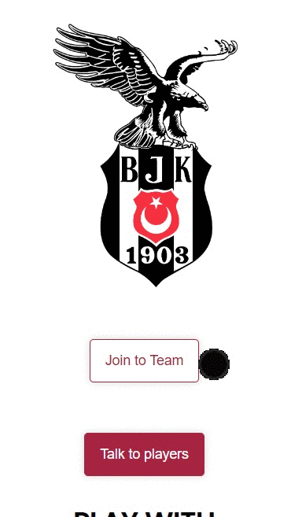

# Styled Component with React 

## Description

Project aims to create a Styled Component app in React.

## Project Skeleton

```
Styled Component with React  (folder)
|
|----readme.md        
├── public
|     └── images
|     └── index.html
│     
├── src
│    ├── components
|    |     └──Container.jsx
|    |     └──Footer.jsx
|    |     └──Header.jsx
│    ├── styles
|    |     └── Button.styled.jsx
|    |     └── Container.styled.jsx
|    |     └── Flex.styled.jsx
|    |     └── Footer.styled.jsx
|    |     └── Global.styled.jsx
|    |     └── Header.styled.jsx
|    |     
│    ├── Data.js
│    ├── App.js
│    ├── App.css
│    ├── index.js
│    └── index.css
├── package.json
└── yarn.lock
```


## Objective

Build web Application using Styled Component ReactJS.

### At the end of the project, following topics are to be covered;

- Styled Component

- HTML

- CSS

- JS

- ReactJS


### At the end of the project;

- Improve coding skills within HTML & CSS & JS & ReactJS & Styled Component. Styled Components used in the project.

- Use git commands (push, pull, commit, add etc.) and Github as Version Control System.

🔗 <b>To see live version<b> 🎯https://tal58.github.io/styled_components_react_bjk/


**<p align="center">&#9786; Happy Coding &#9997;</p>**

<br><br>
🌐 The desktop and mobile versions of the web page are as follows;🧭
<br><br>

## 🖥️Desktop version
<br>

<br>
<br>
<br>
<br>
<br>
<br>
<br>
<br>
<br>
<br><br><br><br><br><br><br><br><br>


## 📱Mobile version
<br>

<br>
<br>
<br>
<br>
<br>
<br>
<br>
<br>
<br>
<br><br><br><br><br><br><br><br><br>


